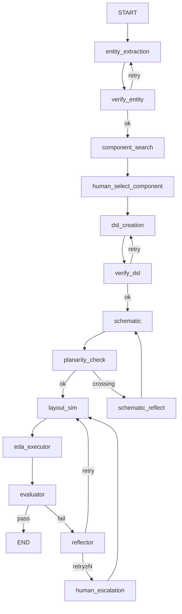
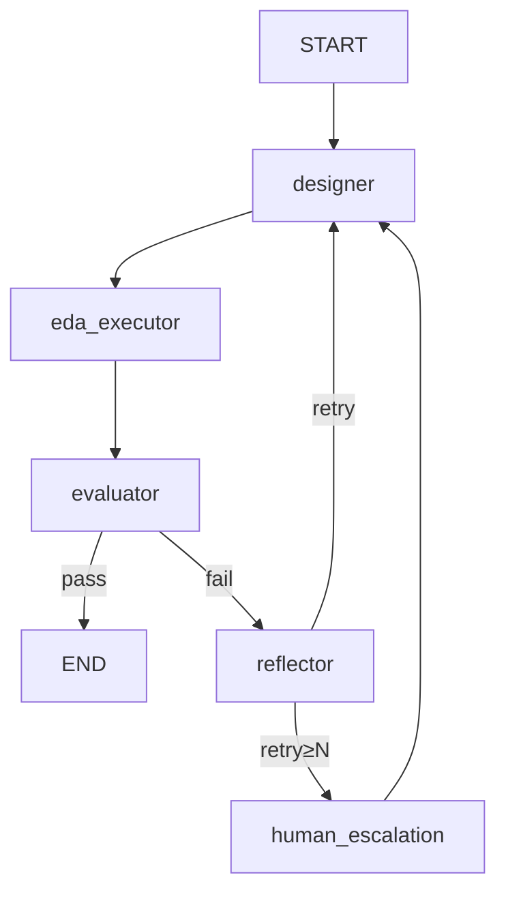

# PhIDO-Reflexion 重构方案

> 本文档总结了将 PhIDO 用 **LangGraph** 重构、并引入 **EDA-Reflexion 闭环**（基于 Shinn et al. 2023 *Reflexion: Language Agents with Verbal Reinforcement Learning*）的整体设计与落地路线。

---

## 0. 重构目标

1. **架构现代化**：把现有 `webapp.py` 中"if/else + try/except + Streamlit session_state"的手搓多步流程，改写为基于 **LangGraph `StateGraph`** 的有状态智能体。
2. **核心目标 —— 引入 EDA → Agent 的反馈闭环**：当前的 EDA 工具（GDSFactory / SAX / KLayout DRC）报错只展示给人类看，**没有任何错误信息回流到 LLM**。本次重构最重要的改动是引入 **Reflector Agent**，由它消化 EDA 工具的结构化错误，给 Designer Agent 提出针对性修改建议，进入下一轮迭代。
3. **可扩展**：每个工作流阶段都可以挂自己的"生成-验证-反思"小循环，本次只先做 Layout→DRC 这一段，其他阶段作为后续改进方向。

---

## 1. 当前项目的问题诊断

### 1.1 不是真正的 agent，只是脚本

- 工作流由 `webapp.run_step_by_step_*` 5 个函数 + Streamlit `session_state` 串起来。
- 状态字段散落（`p100_*` / `p200_*` / ...），没有显式的状态机。
- 不同 LLM 提供商的调用集中在 `llm_api.call_llm`，但缺乏统一的调度/重试/可观测层。

### 1.2 EDA 工具的反馈"黑洞"

| EDA 工具 / 环节 | 错误"流向" | 是否喂给 agent？ |
|---|---|---|
| `DemoPDK.yaml_netlist_to_gds` 中 SAX 缺失模型 | `print("+++++++ MODEL ERROR: ...")` + `session["p400_required_models"].append("ERROR: ...")` | ❌ 仅终端/日志 |
| `gdsfactory` 写 GDS 失败（layer 号过大等） | `except` 里 `st.warning("Creating placeholder file for DRC...")` | ❌ |
| `sax.circuit(...)` 仿真失败 | `try/except` 吞掉 | ❌ |
| **`run_drc` → `report.lydrb`** | `st.text("DRC Report:")` **只给人看** | ❌ 完全没回传 |
| `utils.dot_planarity` 交叉边 | `"Eroor: crossing edges found!"` 字符串返回 | ✅ 但只有这一个回流到 LLM |

> 结论：**今天 PhIDO 只对一个小问题（DOT 边交叉）做了反馈回流；真正值钱的 DRC / SAX / GDSFactory 失败信号全部丢失。** 这正是 EDA-Reflexion 要补的核心缺口。

### 1.3 仅有 Reflexion 之名

- 仓库名为 `PhIDO-Reflexion`，但代码中没有 LangChain / LangGraph 的引用（`requirements.txt` 里 `langchain*` 和 `haystack-ai` 都是未实际使用的依赖）。
- 现有"自检-重写"逻辑只是普通 `try/except` + 字符串校验，没有论文意义上的 Actor / Evaluator / Reflector 三角色分离，也没有 episodic memory。

---

## 2. 总体架构（LangGraph 视角）

### 2.1 状态（State Schema）

用一个**全局累积式 State** 替换零散的 `p100_* / p200_*`：

```python
from typing import Annotated, TypedDict
from operator import add

class PhIDOState(TypedDict):
    # 输入
    user_prompt: str

    # Stage 1: Entity Extraction
    pretemplate: dict | None
    preschematic: str | None        # DOT 字符串

    # Stage 2: Component Specification
    component_candidates: list[list[str]]
    component_scores: list[list[str]]
    selected_components: list[str]
    selected_template: str | None

    # Stage 3: Circuit DSL
    circuit_dsl: dict | None

    # Stage 4: Schematic
    dot_string: str | None
    planar: bool
    port_map: dict | None

    # Stage 5: Layout / Simulation
    gds_path: str | None
    sax_result: dict | None

    # ===== EDA-Reflexion 关键字段 =====
    eda_report: dict | None         # 结构化 EDA 输出（见 §4）
    reflections: Annotated[list[str], add]   # 历次反思（累加）
    retry_count: dict[str, int]              # 各 node 的重试计数

    # 可观测
    token_usage: dict
    timings: dict
```

### 2.2 顶层工作流（5 阶段）的 LangGraph 拓扑



**Mapping 速查**：

| 现状（PhIDO 手搓） | LangGraph 对应 |
|---|---|
| `Streamlit session_state` 存 `p100_*`、`p200_*` 等字段 | `TypedDict` / `pydantic.BaseModel` State |
| `run_step_by_step_*` 五个函数 | 五个 node |
| `try/except` + `dot_verify` + `dot_planarity` + `netlist_cleanup` | `conditional_edges` + Reflector 子图 |
| 不同阶段用不同 LLM 通过 `call_llm` 分派 | 每个 node 内部用 `ChatOpenAI` / `ChatAnthropic` …，或继续包装现有 `call_*` |
| Streamlit UI 驱动"是否进入下一步" | `interrupt` / human-in-the-loop |
| `session.p100_log_filename` + 自写 token 统计 | LangSmith tracing + checkpointer |

---

## 3. 核心：EDA-Reflexion 子图设计

> 这是本次重构最关键、最值得做的部分，严格对标 Shinn et al. 2023。

### 3.1 角色映射（论文 → PhIDO）

| 论文角色 | 本项目对应 | 职责 |
|---|---|---|
| **Actor** | `Designer Agent` | 根据"用户意图 + memory"生成/修改 circuit DSL |
| **Environment** | `EDA Tool Executor`（纯 Python node） | 顺序运行 `yaml_netlist_to_gds` → `sax.circuit` → `run_drc`，**结构化**采集所有错误 |
| **Evaluator** | `Verifier`（纯规则即可） | 把 Executor 输出判成 `pass / fail / score` |
| **Self-Reflection** | `Reflector Agent`（**新增**） | 读 Executor 完整日志 + 当前 DSL + 历史 reflections，输出**针对性修改建议**，追加进 memory |
| **Episodic Memory** | `state["reflections"]` / LangGraph checkpointer | 跨轮持久化；Designer 下一轮 prompt 中带最近 N 条 |

**循环**：`Designer → Executor → Evaluator → (pass? END) → Reflector → Designer`

### 3.2 子图（Layout-DRC PoC）



要点：

1. **`eda_executor` 是纯 Python node，不是 LLM node**——它顺序跑 GDSFactory → SAX → DRC，把所有错误结构化写入 state。即便中间某步失败，后续工具也尽量继续跑（或明确跳过），以便给 Reflector 提供**充分的环境观察**（论文核心要求）。
2. **`evaluator` 用纯规则**（DRC 违规数 + SAX 错误数阈值），**不必用 LLM**；省 token 而且稳定。
3. **`reflector` 是 LLM node，但它不能修改 DSL**，只能写 reflection 字符串。这是 Reflexion 的**核心约束**（分离"反思"和"行动"，防止退化成普通的 LLM-自己改）。
4. **memory**：短期存 `reflections: list[str]`；长期可存 SQLite/Postgres，做跨 session 的 episodic memory（可选优化）。
5. **重试上限**：建议 `N=3`，超过则 `interrupt()` 让人介入（Streamlit 弹 form）。

---

## 4. EDA 工具的"结构化反馈" Adapter

> Reflexion 能否起作用，**完全取决于工具反馈的结构化质量**。散落的 `print` / 二进制 `.lydrb` 对 LLM 是噪声，必须先做一层 adapter。

### 4.1 DRC（最关键）

当前 `drc_script.drc` 已经输出有语义的标签：

```text
si_rib.width(wmin, ...).output("Si_width", "Si minimum feature size violation; min")
si_rib.space(gmin, ...).output("Si_space", "Si minimum space violation; min")
```

改进步骤：

1. 把 DRC 报告从 `.lydrb`（KLayout binary）改成 **`.lyrdb`（XML）或 txt**。
2. 写一个 `drc_parser.py`，把报告解析成结构化列表：

   ```python
   [
     {"rule": "Si_width", "category": "minimum_feature_size",
      "cell": "mzi_2x2_...", "coord": (123.4, 56.7),
      "actual": 0.11, "min": 0.13},
     ...
   ]
   ```
3. **聚合**：5000 条 `Si_width` 不要全部喂 LLM；按规则分桶 + top-k 示例 + 总数统计。
4. 聚合结果即 Reflector 的输入。

### 4.2 SAX / 模型缺失

把 `DemoPDK.yaml_netlist_to_gds` 里的 `print` 全部改为**抛结构化异常**：

```python
class SaxModelMissingError(Exception):
    def __init__(self, missing: list[str], available: list[str]): ...
```

Reflector 拿到 `missing=["mzi_xxx_unknown"]` + `available=list_of_cnames`，可以给出"用 `mzi_2x2_heater_tin_cband` 替换 `mzi_xxx_unknown`"这种非常具体的建议。

### 4.3 GDSFactory 路由 / 端口失配

LLM 最容易犯错的地方（编出不存在的端口、连到自身、方向错）。`gdsfactory.Component.get_netlist()` / `from_yaml` 抛出的异常 message 本身就很结构化，直接塞进 Reflector 即可。

### 4.4 平面性

`utils.dot_planarity` 当前只返回 `True/False`。建议改为返回**哪些边交叉**的列表：

```python
[("C1:o3 -- C2:o1", "C3:o2 -- C4:o1"), ...]
```

这样 Reflector 能给出"把 C3 placement.y 上移 X μm"，而不是空洞地说"有交叉"。

### 4.5 统一格式（建议）

最终 `state["eda_report"]` 推荐统一成：

```python
{
  "ok": False,
  "stages": {
    "gdsfactory": {"ok": True, "errors": []},
    "sax":        {"ok": False, "missing_models": ["..."], "errors": ["..."]},
    "drc": {
      "ok": False,
      "n_violations": 42,
      "by_rule": {"Si_width": 0, "Si_space": 42},
      "examples": [
        {"rule": "Si_space", "coord": [123.4, 56.7], "actual": 0.10, "min": 0.13},
        ...
      ],
    },
  },
  "summary_text": "DRC: 42 violations (all Si_space), concentrated near N1.",
}
```

---

## 5. Reflector Agent 的 Prompt 骨架

```text
你是一名资深的光子集成电路设计审阅者。你不负责直接修改电路，
只输出"下一轮设计应该如何修改"的简明建议。

== 设计意图 ==
{original_user_prompt}

== 当前电路 DSL（YAML） ==
{current_circuit_dsl}

== 本轮 EDA 工具运行日志 ==
GDSFactory: {gf_errors_or_ok}
SAX 模型要求: {required_models}   缺失: {missing_models}
KLayout DRC: 总违规 {n_violations}
  - Si_width: {count}（示例坐标: {top3_coords}）
  - Si_space: {count}（示例坐标: {top3_coords}）

== PDK 约束（摘要） ==
- 最小线宽/间距: 0.13 μm
- 可用器件: {list_of_cnames}
- 每个器件的端口约定: o1..oN 逆时针

== 历史反思（最近 3 条，避免重复犯错） ==
{reflections_last3}

请以 ≤ 150 字的"修改建议"回答，要求：
1. 直接指名要改的节点 / 边 / 参数
2. 说明预计能消除哪些违规类型
3. 如果无法在设计层面解决（例如 PDK 不支持），明确说 "escalate to human"
```

输出（"修改建议"）写入 `state["reflections"]`，Designer 下一轮 prompt 顶部固定带：

```text
=== 上一轮反思（必须遵守） ===
{latest_reflection}
```

---

## 6. 端到端示例（帮助校准期望）

**用户意图**：1×4 WDM @ 1550 nm。

**Designer 第 1 轮输出**：3 个 `mzi_1x2_pindiode_cband`，`length=100`，`delta_length=200/100/100`。

**EDA Executor 结果**：

- GDSFactory: ok
- SAX: ok
- DRC: `Si_space` 违规 42 条，集中在 `N1` 附近；`Si_width` 0 条

**Evaluator**：fail。

**Reflector 输出**：

> "N1 的 `delta_length=200` 导致两臂弯折过近，与相邻 arm 间距 < 0.13 μm，触发 42 条 Si_space 违规。建议：
>
> 1. 把 N1 `delta_length` 从 200 降到 ≤ 100；
> 2. 或保留 200 但在 N1.placement.y 上加 20 μm 间距。
>
> 优先方案 1，对 FSR 影响较小。"

**Designer 第 2 轮**：按反思改 `delta_length=100`，DRC 清零，跑过。

> 这就是 Reflexion 真正省事儿的地方：Designer 不需要从头学 PDK 规则，**只要"照着反思改"**，错误收敛速度比单纯 retry-with-temperature 快一个数量级。

---

## 7. LLM Provider 接入

### 路 A：直接用 LangChain 官方 chat model（推荐长期方案）

- `langchain-openai` / `langchain-anthropic` / `langchain-google-genai` / `langchain-deepseek` / `langchain-nvidia-ai-endpoints`
- **优点**：原生 tracing、token 计数、重试、流式；结构化输出统一用 `model.with_structured_output(PydanticModel)`
- **缺点**：每家要装对应 package；细粒度参数（Claude `thinking`、o1 `reasoning_effort`）需要看每个 integration 的支持

### 路 B：保留现有 `call_openai` / `call_anthropic` …，包成 `RunnableLambda`

```python
from langchain_core.runnables import RunnableLambda

def openai_node(state): ...    # 内部还用现在的 openai SDK
openai_runnable = RunnableLambda(openai_node)
```

- **优点**：迁移成本最低；现有的 thinking 块 / token 统计 / DeepSeek 截断逻辑全部保留
- **缺点**：得不到 `with_structured_output` 这样的统一接口；LangSmith tracing 颗粒度略粗

> **建议**：第一轮迁移走**路 B**，先把"编排"从 `if/else + try/except` 换成 `StateGraph` 就已经有很大收益；第二轮再把底层 LLM 调用换成 `ChatXxx`。

---

## 8. UI 与交互（Streamlit ↔ LangGraph）

1. **LangGraph 负责"图 + 状态"**；Streamlit 只负责**渲染**和**收集用户输入**。
2. 用 `MemorySaver` 或 `SqliteSaver`（`langgraph.checkpoint`）做 checkpointer，每个 Streamlit session 分配一个 `thread_id`。
3. 用 `graph.stream(..., stream_mode="updates")` 实时显示每个 node 进度（替代现在的 `st.status` / 手写日志）。
4. 在需要用户挑组件、改 prompt 的地方用 `interrupt()`；Streamlit 端 `Submit` 后调用 `graph.invoke(Command(resume=user_choice), config)`。
5. Token / 运行时间从 `llm_api.get_token_usage` 迁到 `on_llm_end` 回调 + LangSmith。

---

## 9. 落地路线（最小风险路径）

> 拆成**两条并行的小里程碑**，A 不依赖 LangGraph，独立有价值；B 是 EDA-Reflexion 主菜。

### 里程碑 A：把 EDA 反馈从"给人类看"改成"给 agent 看"

1. 把 `run_drc` 改成**返回结构化对象**（`DRCReport(n_violations, by_rule, examples)`），而不仅写文件。
2. 把 `DemoPDK.yaml_netlist_to_gds` 的 `print` / `session["p400_required_models"]` 改成抛 `SaxModelMissingError`、`NetlistError`。
3. 给 `drc_script.drc` 加 `report_database` 输出 XML；或用 KLayout `-rd report_format=xml`。
4. 当前 Streamlit UI 直接吃这套结构化结果，把 DRC 报告渲染得更友好（顺便受益）。

### 里程碑 B：接入 LangGraph + Reflexion

1. 建 `PhIDOState`（含 `reflections`、`retry_count`、`eda_report`）。
2. 实现 4 个 node：`designer`、`eda_executor`、`evaluator`、`reflector`。
3. **先只接 Layout → DRC 这一段**，跑通 "DRC 违规 → 反思 → 重设 `delta_length` / `length` → 重跑"。
4. 反思模板先手写 prompt，跑通后再接 LangSmith 观察效果。
5. 跑通后再扩展：
   - SAX 反馈（缺模型 / S11 ≠ 预期）
   - GDSFactory routing 错误反馈
   - 把 Reflexion 模板套到 Schematic / Component Selection 阶段（每个阶段都有自己的小 reflexion 闭环）

### 里程碑 C（远期）：全图重构 + episodic memory

1. 把 5 阶段全部迁为 LangGraph node，统一 state。
2. 每个阶段都挂 Actor/Critic/Reflector 三件套。
3. 跨 session 的长期 episodic memory（"曾经触发 Si_space 的 DSL 片段"等）作为 few-shot examples。
4. 切换到路 A（LangChain chat models + `with_structured_output`）。

---

## 10. 设计决策待定项（动手前请先确认）

| # | 问题 | 选项 | 推荐 |
|---|---|---|---|
| 1 | Reflector 是否能看到 PDK 器件源码（docstring）？ | A) 看得到（作为 tool 提供）<br>B) 看不到 | **A**：能给出"换器件"级别的具体建议 |
| 2 | Designer 和 Reflector 共享对话历史？ | A) 共享<br>B) 分开 | **B**：避免反思被错误思路污染（论文做法） |
| 3 | 反思粒度 | A) 每违规一条<br>B) 每轮总结一条 | **B**：避免 reflections 爆炸 |
| 4 | 失败时是否回滚 checkpoint？ | A) 回滚<br>B) 不回滚 | **A**：在 `eda_executor` 前 `put_snapshot`，防止 state 越攒越乱 |
| 5 | Reflector 用哪个模型？ | A) 比 Designer 弱但推理强（如 Claude/4o）<br>B) 同模型 | **A**：论文经验，"视角差异"比"双强"效果更好 |
| 6 | 重构是**就地改** `PhotonicsAI/Photon/`，还是**新开** `PhotonicsAI/graph/` 子模块并存？ | A) 就地<br>B) 并存 | **B**：能灰度切换，旧 Streamlit 不受影响 |
| 7 | LLM 接入路线 | 路 A / 路 B | **第一轮 B，第二轮 A** |
| 8 | 是否接 LangSmith？ | 是 / 否 | **是**：debug Reflexion loop 极有帮助 |

---

## 11. 新增 / 变更的依赖（参考）

- `langgraph`（建议直接用最新稳定版，2026 年时建议 ≥ 0.6）
- `langchain-core`
- 路 A 用到：`langchain-openai`、`langchain-anthropic`、`langchain-google-genai`、`langchain-deepseek`、`langchain-nvidia-ai-endpoints`
- `langgraph-checkpoint-sqlite`（或 postgres）做持久化
- `langsmith`（可选）

> `requirements.txt` 里现存的 `langchain>=0.0.300`、`haystack-ai` 都没被实际使用，重构时应清理或升级到与 `langgraph` 匹配的版本。

---

## 12. 容易踩的坑

1. **Streamlit `rerun` 机制会重跑整个脚本**：`graph.compile()` + checkpointer 必须放在 `@st.cache_resource` 里，避免每次交互都重建图。
2. **Reflections 列表不能无限增长**：prompt 里只带最近 N 条，state 里可以全存，但喂 LLM 时要截断。
3. **KLayout DRC 是子进程调用**：建议包成 `async` node 或后台线程，否则 Streamlit UI 会卡；同步跑则用 `interrupt_after=["drc"]` 留手动继续点。
4. **pydantic 版本**：LangGraph 0.2+ 要 pydantic v2；当前 `google-generativeai` 老版本和 v1 有冲突，迁移时顺带升级到 `google-genai` 新包。
5. **原有 `prompts.yaml` 可继续用**：不必迁成 LangChain `ChatPromptTemplate`，直接当字符串读入并喂给 node，反而保留现有 prompt 的可版本化。

---

## 13. 推荐的 PoC 切入点

如果希望用最小代码量先验证"LangGraph + EDA-Reflexion"的有效性，从下面这一个子图开始：

> **"DSL → 生成 GDS → SAX 仿真 → DRC → 结构化反馈 → Reflector 反思 → Designer 重写 DSL"**

理由：

- 涉及到所有三个 EDA 工具（GDSFactory / SAX / KLayout DRC），是反馈最丰富的环节。
- 是当前代码反馈"丢失"最严重的地方，PoC 价值最高。
- 跑通后即可作为可复用的 `Actor / Executor / Evaluator / Reflector` 模板，其他阶段照葫芦画瓢。

---

## 14. 总结

- **LangGraph 是手段**：用 StateGraph + 显式 conditional_edges 让多步流程可控、可追踪、可回滚。
- **EDA-Reflexion 是核心**：把现在被丢弃的 DRC / SAX / GDSFactory 反馈，通过结构化 adapter + Reflector Agent 接回 Designer，形成真正的"工具环境 → 智能体"闭环。
- **路径渐进**：先做工具反馈结构化（里程碑 A），再做 Layout-DRC PoC（里程碑 B），最后铺到全部 5 阶段（里程碑 C），任何阶段中断都不影响旧版本能用。
- **不引入复杂度的地方**：prompt 仍然走 YAML 文件，LLM 调用前期仍走现有 `call_*`，UI 仍是 Streamlit；只把"编排 + 反馈闭环"集中替换。

---

## 参考

- Shinn et al. 2023, *Reflexion: Language Agents with Verbal Reinforcement Learning*: <https://arxiv.org/abs/2303.11366>
- LangGraph 官方 Reflexion 教程: <https://langchain-ai.github.io/langgraph/tutorials/reflexion/reflexion/>
- 项目基础说明：`./PROJECT_OVERVIEW.md`
- 项目论文：<https://arxiv.org/abs/2508.14123>
